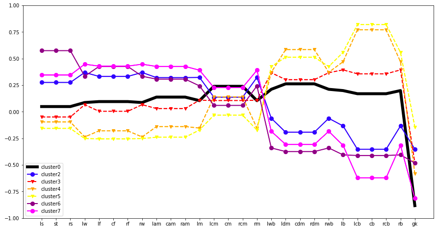

#  Capstone Project - Football Player Recommender System

## Context and Problem Statement

Last year, during the 2019 Ballon d'Or - a yearly awards ceremony that recognizes the best footballer in the world for each year (a very big deal) - Lionel Messi won his 6th Ballon d'Or, the most that any player has won so far.

During his speech, he made this statement: *"I hope to continue for a long time. I realise that I am very lucky, even if, one day, retirement will ring. It will be difficult.*

Players like Messi or Ronaldo will never be completely replaceable, such are their talents and achievements. But we are always trying to search for the "next Messi", the "next Ronaldo", the "next Zidane/*(insert any football legend's name)*". It spurred me into thinking: what if, we could really find someone similar to them, especially with all the footballing data that we have in the world right now?

Hence, I decided to do a project that **aims to find a similar replacement for Lionel Messi**, which is my main problem statement. Building on this, I aim to create a **content-based recommender system** that can find suitable replacements for any given football player (that is present in the dataset).

---

## Executive Summary

### Contents:

1) Business Overview
- [Rationale and Business Objective](#Rationale-and-Business-Objective)
- [Data Objective](#Data-Objective)

2) Tech Overview
- [Approaches](#Approaches)
- [Modelling](#Modelling)
- [Summary of Results](#Summary-of-Results)
- [Sources](#Sources)

---

### 1) Business Overview

#### Rationale and Business Objective:

The inspiration for this project was initially driven by my own passion in the sport (and of course, Messi's landmark statement during his award speech), but having put some thought into it, I also realised how relevant this can be to other industries, beyond sports.

Having come from a banking sales background, I realised the problem that many team managers faced when dealing with the departure of their sales staff (even more so in banking sales, where the turnover rate is extremely high). It's especially problematic when high-performing sales staff depart, leaving behind a huge void in production and revenue. More often than not, in trying to meet the demands of upper management, team managers force another salesperson, who is a less-than-ideal replacement of the departed salesperson, to take up the mantle. Usually this does not turn out well for either parties; the replacement, unsurprisingly, does not perform and match up to the previous high-performer's numbers, creating stress on himself and on the manager, who is at the same time pressured by upper management to deliver the numbers as per before. The manager, in turn, micro-manages his whole team even more, with the replacement likely receiving the most attention - all of which create a vicious spiral that may result in even more staff leaving.

Hence, to this extent, we can consider Lionel Messi to be an example of an extremely high-performer that is about to retire and leave the industry, so we need to find a good replacement for him. This recommender model can then be extended to almost all industries and all kinds of roles (not just sales), since there are always employees seeking to leave and employers always seeking to replace their candidates.

On top of this, because the model will also be based on some metrics of that player/employee (say years of experience, KPI track record, etc), it can also be extended and used as justification for promotions.. and hopefully, reduce the role that politics/bootlicking may play when it comes to promotions! Last but not least, I believe professional social networks such as LinkedIn can also employ such a recommender in terms of applicant matching, since it already has such a huge database of employees with their respective attributes and metrics.

#### Data Objective:

The original data on every player was taken from the FIFA 2020 dataset on Kaggle - **18278 rows (players) x 104 columns, of which 72 are features of interest.**

These features of interest are every player's score for every attribute possible - dribbling, heading, composure, jumping, weak foot, etc. Also included are the positional score for every player - in essence, how well they in a particular position on the field.

Other noteworthy features, which needs subsequent transformation as they are categorical in nature, include player's positions (right-winger, center-back, etc), as well as traits and characteristics, such as 'Selfish Player', 'Dribbler', 'Crowd Favourite'.

I will pre-process all these features and transform them into a distance similarity metric; the idea is that all these scores represent different points in a vector space, with Messi himself also being represented by a combination of his own unique set of scores. Taking all these vector points into consideration, my model will calculate which other players, with their own unique set of scores, are closest (in terms of distance) to Messi's vector points. This is how the similar players are computed and the top 5 will be displayed accordingly. Of course, this doesn't just apply to Messi, but for any given player to be inputted.

#### Evaluation:

As this is a case of unsupervised learning, I will be using **KMeans clustering** to evaluate the model, by iterating over a few clusters and trying to make sense of the subsequent clusterings, before deciding on the number of clusters to choose. The **inertias** (error rate; the lower the better) and **silhouette scores** (how well-defined or well-seperated the clusters are; the closer to 1 the better) will be taken into consideration as well.

---

### 2) Tech Overview:

#### Approaches:

**Phase 1: Simple and Direct Transformation**

Initially, after cleaning and preprocessing the data, I transformed the dataset using a distance metric of cosine similarity. A quick check on the players recommended for Lionel Messi from this first phase of modelling yielded less than desirable results.

In thinking of ways to finetune the model, I considered classifying the attributes into different categories (e.g. basic attributes, technical attributes, mental attributes, etc), then performing the distance transformation on each of these categories of attributes and yield multiple distance matrices, ultimately adding all of them up and taking the mean. However, besides the fact that this is extremely tedious and computationally expensive, this also does not seem like a very academic and rigorous approach. Hence, I did not pursue this method.

**Phase 2: Feature Engineering, Followed By Tweak in Distance Metric**

After some feature engineering, there are a total of **138 features.** I changed the distance metric of choice during the transformation, to **Euclidean distance** as I felt that **magnitude** matters in this situation (cosine similarity disregards the magnitude of the vectors). The subsequent Phase 2 model yielded more appropriate recommendations.

**Phase 3: Model Evaluation and Subsequent Feature Selection**

I wanted to evaluate my model via KMeans clustering and getting the silhouette score and inertia. I proceeded to do so on my Phase 2 model, choosing a cluster of 8. However, it is known that KMeans clustering does not work well for high-dimensional data (I had 138 features altogether).

Hence, I decided to use **Principal Component Analysis (PCA)** to select the features that can explain up to 80% of the data variance. Subsequently, performing KMeans clustering on the post-PCA dataset yielded a lower inertia (lower error rate) and higher silhouette score (better degree of seperation between clusters) for every level of cluster.

#### Modelling:

- Final Model: PCA-transformed Dataset of **6 principal components/features**
- Distance metric transformation: **Euclidean distance**
- Chosen clusters of **k = 8**
    - **Inertia = 97259**
    - **Silhouette score = 0.27**

#### Summary of Results:

For visuals on the comparison plots between Messi and the above similar players in terms for their attributes, please take a look at [Interactive Spider Plots](./Visuals/Interactive%20Spider%20Plots.html).

**Interpretation of Clusters**

Cluster characteristics:

- 0: Central midfielders, ‘engines’ of the team
- 1: Goalkeepers
- 2: Average-low quality forwards and attacking midfielders
- 3: Wingbacks
- 4: High quality and technical central defenders
- 5: Average-low quality central defenders
- 6: ‘Pure’ forwards, out-and-out strikers, target men
- 7: High quality forwards and attacking midfielders

---

#### Sources:

- [Kaggle Dataset](https://blog.collegevine.com/here-are-the-average-sat-scores-by-state/)