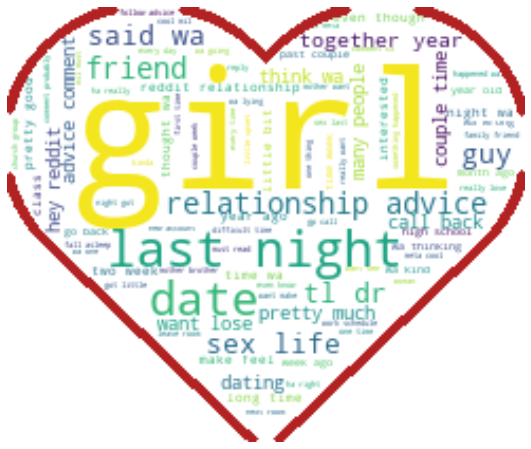

#  

# Project 3: Web APIs & Classification

### Context and Problem Statement

Working in a dating consultancy, where we provide matchmaking, as well as counselling and consultation services to singles, we regularly receive feedback and questions from our clients (dating individuals) during their dating journeys. We have noticed quite a few common topics raised by our clients over the years.

As such, with our newly-created data science team, we have decided to **create a model that can accurately identify and classify these relationship and dating topics**. Hopefully, with this model, we can **create a bot that helps to entertain our client's queries and automate some of the advising and consultation in future**.

We chose to scrape content from two subreddits - r/Dating_Advice and r/Relationship_Advice - as, intuitively, they would seem to have quite some overlap, with the latter subreddit perhaps having some marriage-related topics as opposed to r/Dating_Advice. If our model is able to classify and distinguish between these 2 subreddits of moderate-to-high overlaps, then it would prove to be a robust one that may be deployed in chatbot algorithms.

---

## Executive Summary

### Contents:

- [Exploratory Data Analysis (EDA)](#EDA)
- [Modelling Results](#Modelling-Results)
- [Interpretation of Results](#Interpretation-of-Results)
- [Model Evaluation and Limitations](#Model-Evaluation-and-Limitations)
- [Business Recommendations](#Business-Recommendations)
- [Sources](#Sources)

---

### EDA

After compiling and cleaning the content (removing html codes and whatnot), we have created the above word cloud to visualize the most common words appearing in these subreddits.

Upon further inspection of the word cloud, we also decide to remove words that do not give much context, or are irrelevant to 'normal day-to-day' conversation, such as *https, reddit, tldr*.

All in all, disregarding the aforementioned words, the word cloud does seem representative of typical relationship/dating-related queries and topics.

---

### Modelling Results

#### Baseline score:

|Target Variable|Normalized Counts|
|---|---|
|1|0.523256|
|0|0.476744|

*where 1 equals relationship_advice, 0 equals dating_advice*

In a nutshell, both models definitely outperform the baseline score already.

In essence, cvec stands for Count Vectorizer while tvec stands for Tf-idf Vectorizer, 2 tools that help transform, in their own manner, natural language (speech and words) into a format useful for data analysis. 

For cvec, we ran a logistic regression after tuning its hyperparameters using GridSearchCV. For tvec, we created a Naive Bayes classifier after tuning its hyperparameters as well.

For comparison's sake, we also created a Naive Bayes classifier for the tuned cvec model.
*('LogReg Test Score' for tvec_metrics was obtained from its GridSearchCV pipeline, where LinReg was used as an estimator)*

---

### Interpretation of Results:

Evidently, cvec transformation proves to be better than the other (tfidf) based on the metrics above. Namely, cvec has an accuracy of 0.7500 while tvec has an accuracy of 0.5969. As for the other metrics such as sensitivity, precision and specificity, cvec outperforms tvec in all of them, except for sensitivity, where tvec scores marginally higher than that of cvec (0.7556 vs 0.7333). cvec also has a higher logreg score than tvec (0.8488 vs 0.8236).

It would be more crucial to examine the impacts of false negatives/positives derived from this model.

**False negative** - a body of content, which is actually asking for relationship advice, is being falsely classified as asking for dating advice.

**False positive** - a body of content, which is actually asking for dating advice, is being falsely classified as asking for relationship advice.

In the scenario of a client engagement, this would mean that whatever words he/she feed to the bot (or whatever input-receiver) gets wrongly classified and he/she gets an "incorrect" set of advice. The main question, though, is how "incorrect" this advice is. Considering that the subreddits being analysed are actually quite similar in nature, the erroneous output/advice being churned
out may not be as inappropriate as perceived; in fact, it may very well still be quite applicable to the situation that the client is facing. Of course, this may not happen all the time - one can imagine marriage advice being dished to the confused client due to an unfortunate case of false positive.

---

### Model Evaluation and Limitations:

As mentioned at the end of the Interpretation section above, it would seem that the false positives would be more of a cause for concern than false negatives. Further tuning is needed to optimize for/minimize false positives.

It is important to note that the Reddit community is global, so the audience/contributors come from a mixture of diverse backgrounds ([but mostly skewed towards the States and a few European countries](https://www.statista.com/statistics/325144/reddit-global-active-user-distribution/)). To that extent, since our company is primarily local-based, if a client were to put forth a query that is very local-context-specific, this model might not be able to perform as well as it should, since it may not be able to pick up the keywords of the client's input (e.g BTO, CPF, ROM, local slangs and acronyms).

---

### Business Recommendations:

We would recommend **choosing cvec + Naive Bayes Classifier** for the purpose of our business problem, since it seems to give a higher accuracy/Naive Bayes score, as well as outperforming tvec in almost all other metrics. Of course, more refining is needed, with respect to optimizing for false positivies, but as it stands, the model proves to be robust enough.

---

### Sources:

- [Relationship Advice Subreddit](https://www.reddit.com/r/relationship_advice/)
- [Dating Advice Subreddit](https://www.reddit.com/r/dating_advice/)
- [Generating WordClouds in Python](https://www.datacamp.com/community/tutorials/wordcloud-python)
- [Reddit Traffic by Country](https://www.statista.com/statistics/325144/reddit-global-active-user-distribution/)
